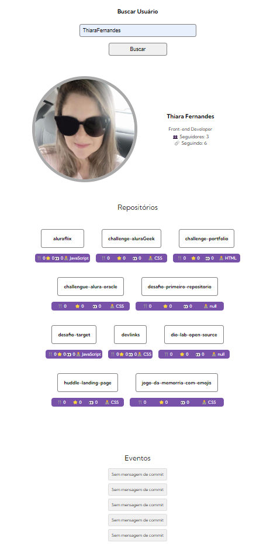

# Projeto Mundo Real com Fetch e GitHub JS Avançado

Este projeto é uma aplicação JavaScript que busca dados da API do GitHub utilizando `fetch` e implementa conceitos avançados de JavaScript, como manipulação assíncrona, promises e renderização dinâmica no DOM. 

## 🚀 Sobre o Projeto

Este projeto visa criar uma aplicação que consome a API pública do GitHub para buscar informações sobre usuários e seus repositórios. Ele utiliza a API `fetch` e explora as boas práticas do JavaScript moderno, como `async/await`, Promises e modularização de código.

O objetivo é oferecer uma interface simples, onde o usuário pode inserir um nome de perfil do GitHub, e o sistema retorna informações como o nome, biografia, seguidores, repositórios e eventos recentes do usuário.

## ⚙️ Funcionalidades

- Busca de perfis do GitHub pelo nome de usuário.
- Exibe o nome, biografia, seguidores e seguindo do usuário.
- Exibe a lista de repositórios públicos do usuário.
- Exibe eventos recentes (CreateEvent e PushEvent) do usuário.

## 🛠️ Tecnologias Utilizadas

As principais tecnologias e ferramentas utilizadas neste projeto incluem:

- **HTML5**: Estruturação da página.
- **CSS3**: Estilização da interface.
- **JavaScript**: Lógica da aplicação, requisições assíncronas e manipulação do DOM.
- **Fetch API**: Para consumo de dados da API do GitHub.
- **GitHub API**: Fonte de dados para os perfis e repositórios.

## 📝 Licença
Este projeto está licenciado sob a licença MIT - consulte o arquivo `LICENSE` para mais detalhes.